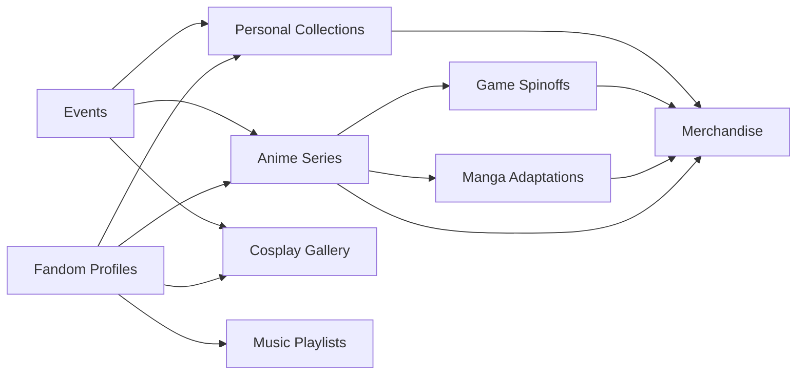

# 🌌 Aniverse: The Living Anime Metaverse Repository

> **"Step into the universe where anime, manga, visual novels, music & cosplays coexist—indexed, interconnected, and interactive."**

---

---

## 🗂️ Project Overview

**Aniverse** is a revolutionary, living, breathing index and universe for anime, manga, collectibles, music, games, art, doujin, and cosplay. Designed for explorers, archivists, fans, and creators alike. This is not just another database. It is a dynamic map—a tapestry—of Otaku culture in 2026! 

### ⭐ Mission

Build the definitive, openly extensible, cross-media metaverse index for the global otaku community. With multilingual support, seamless OpenAI and Claude API integrations, and a beautiful responsive UI, Aniverse serves as your ever-evolving passport across anime worlds.

---

## 🚀 Quick Download

Get the latest version to launch your Aniverse journey:

---

## 🌏 Compatibility Matrix

|  🌐 OS        | Supported | Notes                       |
|:------------:|:---------:|:----------------------------|
| 🪟 Windows   |  ✅       | Full features               |
| 🍏 macOS     |  ✅       | Apple M1/M2 optimized       |
| 🐧 Linux     |  ✅       | Light and compatible        |
| 📱 Android   |  ✅       | Mobile UI, voice input      |
| 📱 iOS       |  ✅       | Sidecar, push notifications |

---

## 🌸 Key Features

- **Metaverse Index Engine:** Connects anime series, games, cosplays, music, and collectibles through semantic nodes.
- **Profile Cosmos:** Create shareable, dynamic profiles across the multiverse.
- **Smart Recommendations:** OpenAI & Claude API integrations provide personalized discovery.
- **Multilingual Multiverse:** Full i18n support—Japanese, English, Chinese, Spanish... and more!
- **Responsive, Adaptive UI:** Effortless navigation on desktop, tablet, or mobile.
- **Collector Mode:** Track, tag, and share your stash: figures, manga, artbooks, CDs.
- **Event Portal:** Live feeds of conventions, meetups, releases, and digital watch parties.
- **API for Creators:** Build your bots, import/export, or automate updates.
- **Dynamic Search:** Fuzzy, natural-language, voice-assisted, and emoji-based!
- **24/7 Community Assistance:** Our support system is always open—real fans helping real fans.
- **SEO Harmony:** Your profile, lists, and event posts are ready for search engines, broadening connectivity across the fandom multiverse.

---

## 🔮 The Aniverse Model (Mermaid Diagram)

Showcasing interconnections across media, users, and universe:

---

## 📝 Example Profile Configuration

Create your unique presence! Sample configuration, stored as `aniverse_profile.yaml`:

    username: SailorNova
    preferred_language: Japanese
    favorites:
        - anime: "Cardcaptor Sakura"
        - manga: "Yotsuba&!"
        - game: "Persona 5 Royal"
        - figure: "Rem - Re:Zero 1/7 Scale"
    collections:
        manga: 146
        figures: 12
        artbooks: 7
    events_attending:
        - AnimeJapan 2026
        - Online Watch Party: Demon Slayer Finale
    ai_settings:
        ai_recommender: OpenAI
        notification_level: verbose

---

## 💻 Example Console Invocation

Launch Aniverse with custom commands:

    $ aniverse --profile SailorNova --lang en --openai-key=YOUR_KEY --claude-key=YOUR_KEY
    Welcome SailorNova!
    🏆 You have 146 manga, 12 figures, and 7 artbooks.
    🎉 Next Event: AnimeJapan 2026.
    🤖 Recommendation: "Check out 'Horimiya: Piece' based on your Cardcaptor Sakura collection!"

---

## 🎇 Features List (SEO & Discoverability)

- Anime/manga/game/figure/cosplay interconnected index
- Multilingual friendly search (best for global otaku fans)
- OpenAI and Claude powered recommendations for personalized experiences
- Mobile-first, responsive UI making Aniverse accessible on any device
- 24/7 global community support with live chat and ticketing
- API and webhook endpoints for automation and integration with your favorite tools
- Dynamic event tracker for upcoming anime conventions, releases, and digital fandom events
- Collector’s dashboard with virtual shelf visualization
- Voice input & emoji search lets you explore creatively
- SEO-tuned structured data for profiles and lists: appear in fandom web searches globally
- User-driven content: reviews, watch lists, cosplay galleries, customizable tags

---

## 🤝 Integrations: OpenAI & Claude API

Unlock deeper insights and smart indexing:

- **OpenAI GPT & Claude LLM** for recommending shows, cross-linking trivia, automated list tagging, and voice summaries.
- Plug in your own API keys in your profile settings or via command line.
- Enjoy proactive, AI-powered notifications about collection matches, new releases, and event reminders.

---

## 🌏 Multilingual & Responsive

- Switch instantly between languages
- RTL/LTR support to welcome every written culture
- UI adapts to your device—navigate the Aniverse anywhere, anytime

---

## 🛡️ License

This project is licensed under the **MIT License**. See [LICENSE](LICENSE) for more info.

---

## 📢 Disclaimer

Aniverse is a community-driven open index and metaverse. All content is for cultural, research, and entertainment purposes. We do not host or encourage unauthorized sharing of copyrighted material or direct links to protected works. Trademarks, copyrights, and fandom content are property of respective rights holders.

---

## 💬 Support and Contributing

**Join the Aniverse custodians!**  
Open issues, submit pull requests, or join community calls year-round (24/7) and help us map out the ever-growing otaku universe. Our support is more tireless than a shonen main character!

---

## 🎁 Download Again and Travel Further

---

**Embrace the Aniverse—a bridge to every world you love.  © 2026**